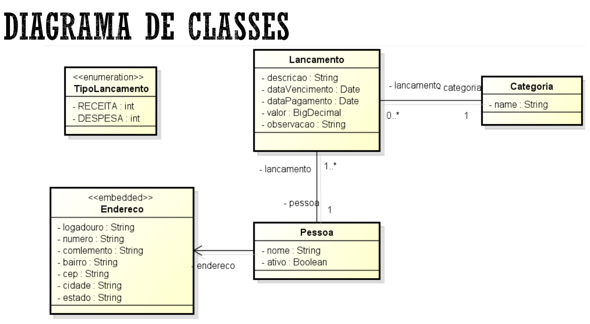

# API de Sistema Financeiro
Projeto desenvolvido durante o 3° período do curso de Sistemas para Internet na instituição de ensino Uniesp, pela disciplina ministrada pelo professor Antônio Junio da Mata.
## Sobre o projeto:
Diagrama de classes do sistema financeiro desenvolvido:

  
- Domain
  - Pessoa
  - Categoria
  - Lancamento
  - Endereco 
- Serviços
  - CRUD de lançamentos
  - CRUD de pessoas
  - CRUD de categorias 
- Tratamendo de erros personalizados
  - Classe [ResourceExceptionHandler.java](src%2Fmain%2Fjava%2Fbr%2Fcom%2Ffinancialsystem%2Fapi%2Finfra%2FResourceExceptionHandler.java) 